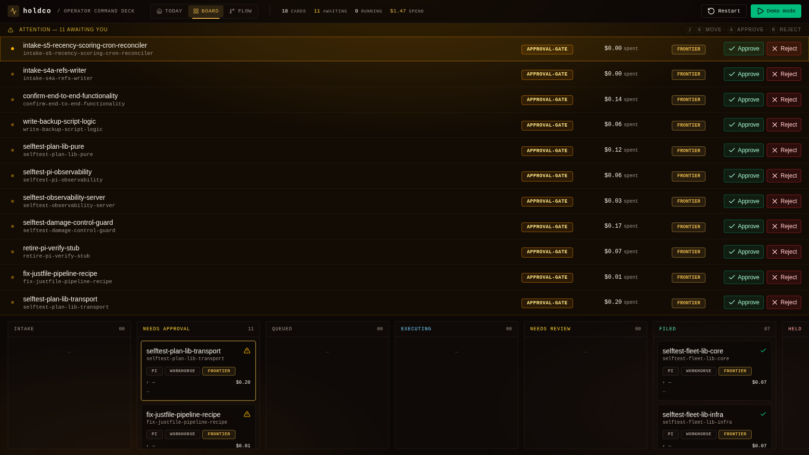
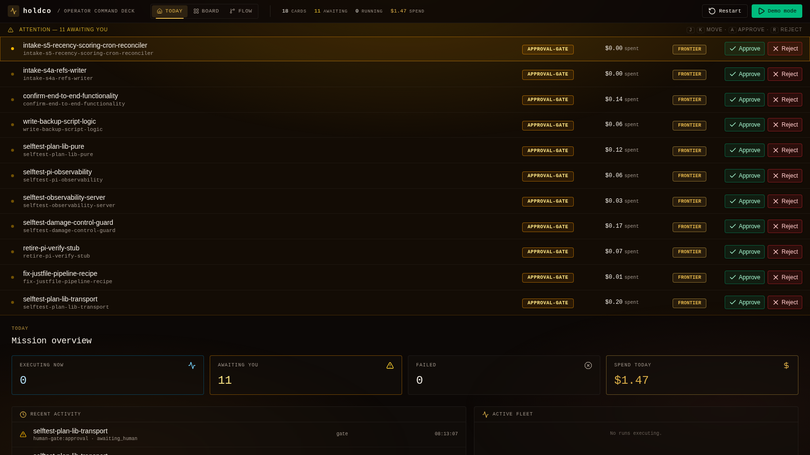
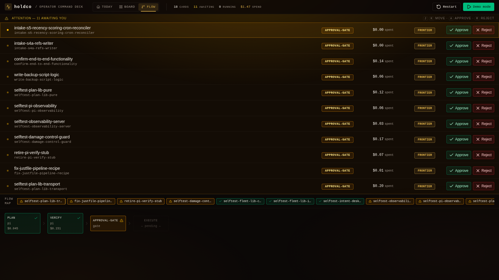

# holdco

**Run coding agents as governed workers. Real git isolation, human-by-exception gates, a board that's just markdown files.**



holdco drives the coding-agent CLIs you already use (Claude Code, Codex, Pi) as workers on a plain-markdown kanban board. Every task runs in its own git worktree, a human approves only where it matters, and the engine can never skip a gate. Plain Node, zero dependencies.

> Early public release (v0). Extracted from a system I run daily to operate my own projects. The engine, seams, and conformance suites below are implemented and tested; the deck UI shown here ships as a separate app.

## Who this is for

You already drive coding agents from the terminal and want a governance layer around them, not another framework to marry. holdco gives you git-worktree isolation so a worker can't touch your live tree, human gates you actually control (illegal moves auto-revert), cost-aware model routing, intake from email or Discord, and a board you can read with `ls`.

It is **not** an in-memory agent framework. It orchestrates the CLIs you already run, on a real filesystem, with git as the substrate, and it doesn't lock you to a model or a vendor. If that's the wrong shape for you, [LangGraph](https://github.com/langchain-ai/langgraph), [CrewAI](https://github.com/crewAIInc/crewAI), and the vendor agent SDKs orchestrate at the API level instead.

## What it looks like running

Every screenshot below is the deck on a live run, not a mockup.

**Today.** What is executing, what is waiting on you, what failed, and what it has cost so far. Spend is tracked per card, so the number at the top is real money, not an estimate.



**Flow.** Each card walks a guarded state machine. Plan and verify complete with their own per-stage cost, execution stays pending until a human clears the approval gate, and an illegal transition auto-reverts. This is what human-by-exception actually looks like in practice.



## The thesis

1. **60/30/10.** 60% dumb infrastructure, 30% orchestration, 10% AI. Models are fuel and fuel commoditizes; the context layer survives every model swap.
2. **Context engineering > prompting.** The durable asset is engineered structure: routing tables, per-card workspaces, constraint files, filed knowledge artifacts.
3. **Human-by-exception.** Every work item is a markdown card running a guarded state machine. Humans hold gates only where judgment matters, and the engine can never skip one, because illegal transitions auto-revert. Every loop closes into a filed artifact, nothing evaporates into chat history.
4. **Harness-agnostic.** The engine doesn't care whether the worker is Pi, Claude Code, or Codex. Coding harnesses plug in on the execution side, connectors (email, Discord) plug in on the intake side, and the engine sits in the middle enforcing the same policy natively on every side.

```
  intake connectors                                  coding harnesses
  ─────────────────          ┌────────────┐          ────────────────
  email (IMAP)  ──┐          │            │          ┌── Pi
  Discord       ──┼── cards ─►   engine   ─ workers ─┼── Claude Code
  telemetry     ──┘          │            │          └── Codex (pluggable)
                             └─────┬──────┘
                                   │ StageEvents (SSE)
                             ┌─────▼──────┐
                             │    deck    │  attention rail · kanban · flow map
                             └────────────┘
```

Deep dives: [docs/ARCHITECTURE.md](docs/ARCHITECTURE.md) · [docs/HARNESSES.md](docs/HARNESSES.md) · [docs/ROUTING.md](docs/ROUTING.md) · [docs/DECK.md](docs/DECK.md)

## Quickstart

Requires Node ≥ 24 and the [`claude` CLI](https://claude.com/claude-code) installed + authenticated. No dependencies to install.

```bash
git clone <this-repo> holdco
mkdir my-board && cd my-board && git init -b main
git commit --allow-empty -m init

# 1. run the engine (scaffolds cards/ + knowledge/ on first boot)
node ../holdco/src/cli.ts serve --sweep-ms 1000

# 2. in another terminal: drop a card at the human gate
cat > cards/hello.md <<'EOF'
---
type: card
id: hello
title: "First card"
status: Needs Approval
card_type: maintenance
---

## Brief
Create a file HELLO.md containing one line: `hello from holdco`.

## Reconciler Log
EOF

# 3. approve it. that's the only human step
node ../holdco/src/cli.ts move hello Queued
```

Within a few seconds the daemon classifies the card (cheap model → workhorse tier), cuts an isolated git worktree, runs a headless Claude Code worker in it with the safety policy hooked in natively, and lands the card at `Needs Review` with the harvested diff, outcome, and cost written onto it. `cat cards/hello.md` to see everything. Add `--obs-url` + `holdco obs` for live StageEvent telemetry.

## What's real today

Everything below is implemented in this tree, covered by `npm test` (plain Node, no test framework, no dependencies), and exercised end-to-end by the live proof scripts in `scripts/`.

- **State machine** (`src/engine/state-machine.ts`). The legal-transition matrix: 8 live columns + 4 sinks, per-edge actor permissions (`human` / `engine`), goal-DAG holding column. Illegal transitions auto-revert.
- **Cards are markdown** (`src/engine/frontmatter.ts`). The board is a directory of `.md` files; status writes are field-preserving and line-scoped. Any editor is a client.
- **Reconciler** (`src/engine/reconciler.ts`). Snapshot-diff sweep detects human moves, enforces the matrix, quarantines invalid cards, recovers orphaned executions on restart.
- **Worker isolation** (`src/engine/git-ops.ts`, `src/engine/workspace-manager.ts`). Per-card git worktrees; merge-back diffs against creation base (not HEAD) so committed and uncommitted worker output both land; capped concurrency, crash-resume, startup reaper.
- **Worker pool + orchestrator** (`src/engine/worker-pool.ts`, `src/engine/orchestrate.ts`). N-slot dispatch through the Harness seam; per-run budget kill, activity watchdog, circuit breaker; human pull-backs always win the drain race.
- **Harness seam** (`src/harness/`). The `spawn / inject / poll / collect / dispose` contract, a shipped conformance suite, and one policy evaluator enforced natively per harness: **Claude Code** (headless sessions, PreToolUse hook guard), **Pi** (herdr panes, tool-call guard extension), **Codex** (documented stub, pass conformance to finish it). See [docs/HARNESSES.md](docs/HARNESSES.md).
- **Unified knowledge layer** (`src/knowledge/store.ts`). One governed `knowledge/` dir per board: single-source `constraints.md` rendered into every worker on every harness (conformance-tested), single-source `permissions.json` enforced natively per harness (fail-safe: a broken config narrows authority, never widens it), per-card append-only message logs.
- **Classifier + cost routing** (`src/routing/`). Cheap-model triage answers delegation / complexity / outcome per card; `knowledge/routing.json` maps class → tier (`chore → workhorse`, `plan → frontier`). Decision lands on the card as provenance; a human-pinned `model:` always wins; a dead classifier degrades to deterministic rules. See [docs/ROUTING.md](docs/ROUTING.md).
- **Intake connectors** (`src/connectors/`). `subscribe → normalize → draft card w/ provenance`. Discord (REST polling) + IMAP (minimal IMAP4rev1 over TLS) ship, with a conformance suite as the acceptance bar for Slack/Telegram/webhook contributions. Drafted cards land at Draft, and nothing executes until a human promotes them.
- **Telemetry + observability server** (`src/telemetry/`, `src/obs/`). StageEvents emitted at the harness boundary (identical sequences regardless of adapter, test-enforced parity); `holdco obs` ingests schema-validated events into SQLite and fans them out over SSE.
- **Versioned schemas** (`schema/`). JSON Schemas for every data contract (card frontmatter, StageEvent, filing artifact, constraints, permissions, routing), fixture-validated in CI by a zero-dep validator.

## Roadmap

- [ ] **Deck UI.** Attention rail, kanban, live flow map with per-node prompt/spend inspection. Builds externally against the frozen data contract in [docs/DECK.md](docs/DECK.md); `holdco replay` feeds it a synthetic demo board today.
- [ ] **Codex adapter.** The stub ships with an implementation sketch; the conformance suite is the finish line.
- [ ] **Safety-policy conformance expansion.** Broader path-scoped write-guard coverage, enforced natively per harness.

Run the tests: `npm test`. Typecheck: `npm run typecheck`. See [CONTRIBUTING.md](CONTRIBUTING.md).

## License

MIT

## Credits & prior art

holdco grew out of a production system built on **Pi** (`pi-coding-agent`, by Mario Zechner), a lean, extensible coding-agent substrate whose extension model shaped the seams here. The Pi harness adapter targets it directly, with **herdr** as the pane transport. The intellectual lineage is public and old: Doug Engelbart's augmentation thesis, that the machinery around the intelligence is what compounds, and the "thin AI, thick infrastructure" school of agent design that the 60/30/10 split encodes. Thanks to all of it.
